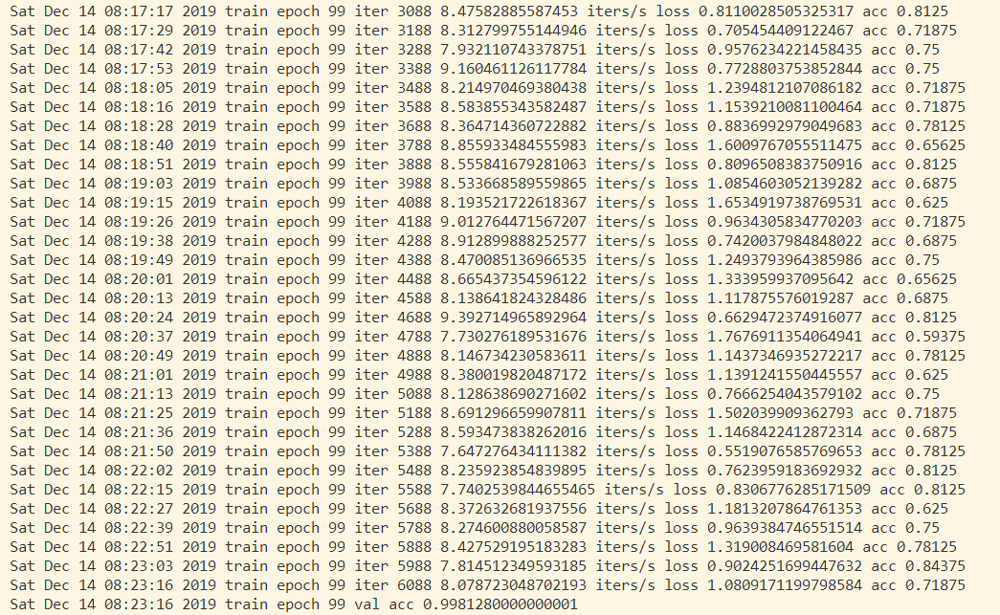
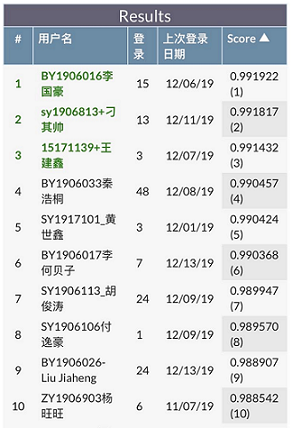

# 人脸识别比对-技术文档
**作者：** BY1906017-李何贝子

本文档描述了本次个人作业中所解决的问题内容，问题分析，处理办法以及实验结果。文档中包含了部分关键代码，完整的实验包代码将随附件给出。
## 问题概述
人脸识别比对属于CV问题，需要根据训练集，训练人脸识别模型，然后对测试集每对人脸图片提取表征向量计算相似度，输出是（1）否（0）为同一个人的预测概率值进行人脸比对。
****
## 基础分析
人脸识别是CV的经典问题。目前基于深度学习的常用问题解决框架为：收集带人脸图像归属ID的数据集，在这一数据集上训练人脸的分类问题，除去最后用以分类的网络结构（一般为全连接层）后的最后一层网络输出的Feature Map作为人脸识别得出的人脸Feature。

基于深度学习的人脸识别方法在数据增强(Data Augmentation)、网络结构(Network Structure)、损失函数(Loss Function)、距离函数(Metric Fucntion)、优化器(Optimizer)等方面都有相应的改进工作。而在生产环境中，所用数据集的数据量、抽样特性、分布特性对最终模型的精度有较大的影响。这里着重对数据集进行分析，为进一步阐述本工作在数据增强方面进行的操作提供支撑（综合数据增强操作，在某一步优化中提升精度由`0.9850+`至`0.9903+`）。
### 训练数据分析
* **初步分析：** 经过3次随机采样分析（每次选取30人，观察30人的人脸数据情况）。数据数量分布方面，本数据集中的大部分标签的人脸数据个数为`10`，少部分标签的数据远小于`10`。数据质量方面：大部分数据画面中的中心大部分区域被人脸占据，而对于同一个标签的不同数据的光照情况不一，色彩空间（黑白、彩色）图像风格不一，人脸角度不一，人物岁数不一；但不同标签之间的数据多样性情况并不一致，部分标签内的数据之间质量条件较为统一，而部分标签内的数据之间质量条件有较大差异。
* **图像清晰度：** 以两个指标分析数据的图像清晰度：分辨率和峰值信噪比。经过统计发现，数据集的分辨率的极差较大，标准差差异不明显，而在`resize`到`128*128`后分辨率差异不大。峰值信噪比方面，总体差异较大，而标签之间的分布差异也较为明显——部分标签内有不同峰值信噪比的数据，而部分标签内的数据峰值信噪比较为接近，这在一定程度上属于一种类别不均衡，可能影响模型的泛化能力。这一点在后续的实验中在一定程度上得到了证明。
* **错误标签：** 使用了在更大人脸数据集上表现较好的公开模型分析了当前训练数据，发现各标签下的数据相似度都较高，但也有小部分相似度较低的数据，人工检查后发现判定难度较高，这里暂不进行处理。

### 常用方法
经过调研，基于深度学习的人脸识别方法按时间顺序主要有[DeepFace, CVPR2014](https://www.cs.toronto.edu/~ranzato/publications/taigman_cvpr14.pdf)、[FaceID, CVPR2014](http://mmlab.ie.cuhk.edu.hk/pdf/YiSun_CVPR14.pdf)、[FaceNet, CVPR2015](https://arxiv.org/abs/1503.03832)、[VGGFace, 2015](http://www.robots.ox.ac.uk/~vgg/publications/2015/Parkhi15/parkhi15.pdf)、[SphereFace, CVPR2017](https://arxiv.org/abs/1704.08063)、[CosFace, CVPR2018](https://arxiv.org/abs/1801.09414)、[ArcFace, CVPR2018](https://arxiv.org/abs/1801.07698)。

* **DeepFace**是Facebook CVPR2014年发表，主要用于人脸验证，是深度学习人脸识别的奠基之作，超过了非深度学习方法Tom-vs-Pete classifiers、high-dim LBP、TL Joint Bayesian等。
* **DeepID**（Deep hidden IDentity features, 深度隐藏的身份特征）是港中文孙祎、汤晓鸥于CVPR2014年发表，通过深度学习得到了高度紧凑和有判别度的特征DeepID。
* **FaceNet**是谷歌于CVPR2015.02发表，提出了一个对识别、验证、聚类等问题的统一解决框架，即它们都可以放到特征空间里做，需要专注解决的仅仅是如何将人脸更好的映射到特征空间。
* **VGGFace**是牛津大学视觉组基于该组提出的VGGNet的人脸识别方法，于2015年发表。目标时构建最少的人为干预大规模人脸数据集，使训练的卷积神经网络进行人脸识别，通过比较两个人脸嵌入的欧式距离来验证同种人。
* 从**SphereFace**开始，人脸识别的发展方向开始注重改进Loss Function和Metric Function。目前公开的效果最好的方法是**ArcFace**。SphereFace由佐治亚理工学院Weiyang Liu等在2017年发表，提出了将Softmax Loss从欧几里得距离转换到角度间隔，增加决策余量m，限制`||W||=1`和`b=0`。ArcFace由伦敦帝国理工学院邓建康等在2018年发表，在SphereFace基础上*改进了对特征向量归一化和加性角度间隔* ，提高了类间可分性同时加强类内紧度和类间差异。

****
## 技术实现
本工作主要基于ArcFace构建模型，在超参设置上进行探索。在探索的同时着重进行了数据增强的工作，使得最终的模型有较好的泛化能力。
本工作主要参考了以下工程实现：

```
https://github.com/auroua/InsightFace_TF
https://github.com/MuggleWang/CosFace_pytorch
```
### 网络结构
本工作使用的网络结构基本与Arcface公开版本相同：基于Resnet修改了BasicBlock的最后若干层的结构。具体实现在软件包的`./models/resnet.py`文件中，主要的类为`ResNetFace`。
实现上参考了Pytorch模型仓库的Resnet实现。

### 损失和距离函数
模型主要使用了`Focal Loss`损失函数:
```Python
def FocalLoss(self, input, target):
    logp = torch.nn.CrossEntropyLoss(input, target)
    p = torch.exp(-logp)
    loss = (1 - p) ** self.gamma * logp
    return loss.mean()
```
距离函数为：
```Python
class ArcMarginProduct(nn.Module):
    def __init__(
        self,
        in_features,
        out_features,
        s=30.0,
        m=0.50,
        easy_margin=False):
        
        super(ArcMarginProduct, self).__init__()
        self.in_features = in_features
        self.out_features = out_features
        self.s = s
        self.m = m
        self.weight = Parameter(
            torch.FloatTensor(
                out_features, 
                in_features)
            )
        nn.init.xavier_uniform_(self.weight)

        self.easy_margin = easy_margin
        self.cos_m = math.cos(m)
        self.sin_m = math.sin(m)
        self.th = math.cos(math.pi - m)
        self.mm = math.sin(math.pi - m) * m

    def forward(self, input, label):
        cosine = F.linear(
            F.normalize(input),
            F.normalize(self.weight))
        sine = torch.sqrt(
            (1.0 - torch.pow(cosine, 2)
            ).clamp(0, 1))
        phi = cosine * self.cos_m - sine * self.sin_m
        if self.easy_margin:
            phi = torch.where(cosine > 0, phi, cosine)
        else:
            phi = torch.where(
                cosine > self.th,
                phi,
                cosine - self.mm)
        one_hot = torch.zeros(cosine.size(), device='cuda')
        one_hot.scatter_(1, label.view(-1, 1).long(), 1)
        output = (one_hot * phi) + ((1.0 - one_hot) * cosine) 
        output *= self.s
        return output
```
### 训练参数组合
在进行初步探索时，使用的参数如下：
```python
num_classes = 10010 #多了若干类
metric = 'arc'
use_se = False
loss = 'focal_loss'
train_batch_size = 128 #主要问题
optimizer = 'sgd'
lr = 1e-1  # 初始学习率
lr_step = 10 # 每隔10个epoch
lr_gamma = 0.1 # lr = lr * 0.1
weight_decay = 5e-4
```
本次训练的速度较快但是最后结果并不能收敛，分析原因主要为数据集过小，使用`train_batch_size = 128`难以收敛。

修改`train_batch_size = 16`后测试精度为`0.97`左右，进一步分析发现
`lr_step = 10`使得最后的`lr`过小，更新失效。进一步实验改进了收敛速度`lr_step = 20`，并尝试`train_batch_size = 32`。改进后的精度达到了`0.98`。

进一步尝试了数据增强，经过调整，这里使用了库，概率性调整代码（数据增强完整代码在软件包`./script/enhance.py`中）实现如下：
```Python
def strong_aug(p=1):
    return Compose([
        HorizontalFlip(p=0.65), # 水平翻转
        OneOf([
            IAAAdditiveGaussianNoise(),
            GaussNoise(),
        ], p=0.6), # 噪声
        OneOf([
            MotionBlur(p=.4),
            MedianBlur(blur_limit=3, p=.5),
            Blur(blur_limit=3, p=.5), 
        ], p=0.5), # 模糊
        ShiftScaleRotate(shift_limit=0.01,
            scale_limit=0.01,
            rotate_limit=30, p=.8), 
            # 移动，缩放，旋转
        OpticalDistortion(p=0.36), # 镜头畸变
        OneOf([
            CLAHE(clip_limit=2), # 通道压缩
            IAASharpen(), # 锐化
            RandomContrast(), # 对比度
            RandomBrightness(), # 亮度
        ], p=0.6), # 图像处理
        HueSaturationValue(p=0.3), # HSV空间变化
        ToGray(p=0.75), # 转换为灰度
    ], p=p)
```
在数据增强时，将每一个标签的目标数据数量设定为`20`，对于大部分数据而言，原始数据和调整过的数据的数量相同，同时在数据增强的过程中平衡了每个标签的样本数量。为了防止过拟合，接下来的实验选取了较小的`epoch `。

****
## 训练效果
本工作的实验过程大致符合最好成绩的`Break Down`，由于资源有限这里不再对最好成绩组合中的每一个提升方法进行控制变量测试。

### 本地实验效果
大部分结果记录整理如下。

| Info | Val | Test |
|  --- | --- | ---  |
| Batch Size: 16 | 0.997 | 0.973458 |
| Batch Size: 32 | 0.998 | 0.988401 |
| Batch Size: 32. Data Enhance: 12 Photos/Label. Epoch: 90.  | 0.997 | 0.985875 |
| Batch Size: 32. Data Enhance: 12 Photos/Label. Epoch: 80.  | 0.997 | 0.985823 |
| Batch Size: 32. Data Enhance: 12 Photos/Label. Epoch: 50.  | 0.997 | 0.986539 |
| Batch Size: 32. Data Enhance: 12 Photos/Label. Epoch: 40. Slow Down LR Decreasing Speed. | 0.997 | 0.990291 |
| Batch Size: 32. Data Enhance: 20 Photos/Label. Epoch: 50. Slow Down LR Decreasing Speed. | 0.998 | 0.990368 |

最初若干实验，没有进行结果截图，这里给出后续部分实验的本地运行结果截图。



### 比赛成绩
本工作的最好成绩（截止20191214下午15:00）排名第6，`score:0.990368`。
